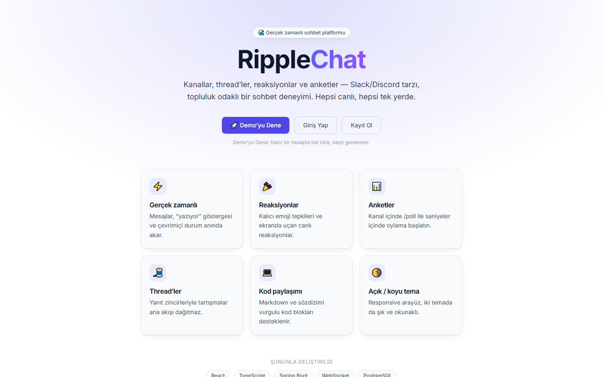
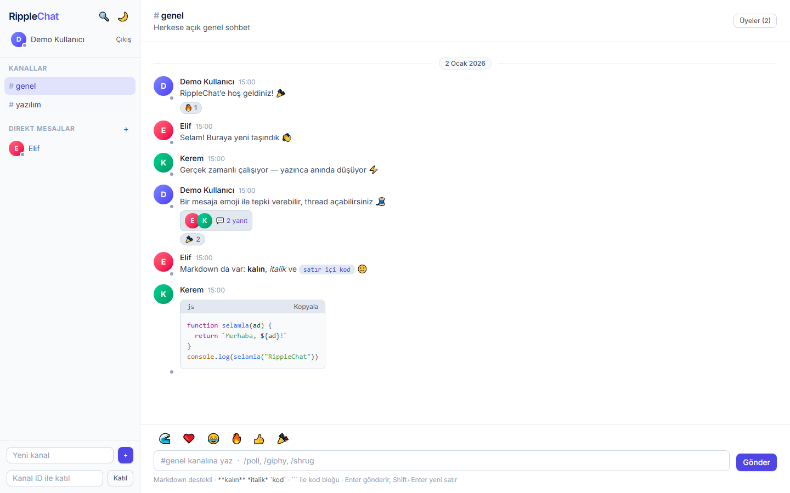
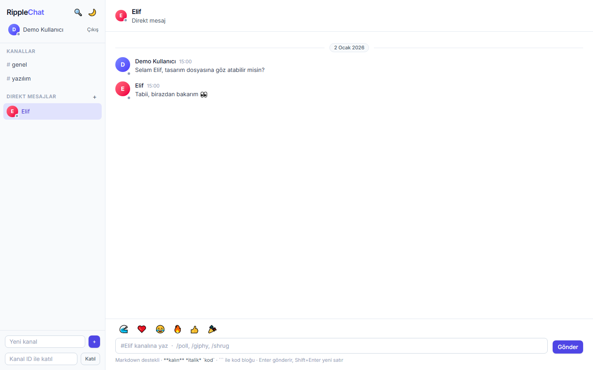

<p align="center">
  
</p>

# 💬 RippleChat

**Real-time, community-driven messaging platform** — a Slack/Discord-style workspace where channels, threads, reactions, and presence all update live over WebSockets. Built with a Spring Boot backend and a React + TypeScript frontend.


---

## 🔗 Live Demo

- **App:** <https://ripplechat-app.vercel.app>
- **API docs (Swagger UI):** <https://ripplechat-backend.onrender.com/swagger-ui.html>

> Hosted on free tiers, so the backend may take ~30–60s to wake on the first request (the UI shows a "waking up" notice). On the landing page, click **“Demo’yu Dene”** for a one-click guided account — no signup needed.



---

## ✨ Features

### ⚡ Real-time
- **Live messaging** over WebSocket / STOMP — messages fan out instantly to every subscriber of a channel
- **Presence** — see who's online at a glance
- **Typing indicators** — know when someone in the channel is composing a message
- **Automatic reconnection** — the client recovers transparently from dropped connections, with a visible connection banner

### 💬 Messaging
- **Channels** with membership management
- **Direct messages** — private 1:1 conversations that reuse the same real-time pipeline
- **Threads** — keep focused reply chains off the main timeline
- **Edit & delete** messages, with soft delete so history stays consistent
- **Markdown** formatting and **syntax-highlighted code blocks**
- **Full-text search** (PostgreSQL `tsvector` + GIN index) across your channels and DMs
- **Infinite scroll** — older history loads as you scroll up

### 🎉 Interaction
- **Persistent emoji reactions** on any message
- **Live flying emoji** — reactions burst across the screen in real time
- **Polls** — create and vote on polls right inside a channel (`/poll`)
- **Slash commands** — an extensible command system (`/poll`, `/giphy`, `/shrug`)

### 🔐 Security & Authorization
- **JWT authentication** with stateless sessions and BCrypt-hashed passwords
- **Refresh tokens** with rotation and server-side revocation — short-lived access tokens are renewed transparently, and logout truly invalidates the session
- **Role-based authorization** per channel: `OWNER` › `MODERATOR` › `MEMBER`
- **Channel moderation** — owners and moderators manage membership and content; all checks are enforced server-side
- **Private channels** — live messages are restricted to members; subscriptions are authorized per channel so non-members (or removed members) can't eavesdrop
- **Abuse protection** — input size limits plus rate limiting on login, message sends, and reactions

### 🎨 Experience
- **Light / dark theme** toggle
- **Responsive layout** that adapts to mobile
- **Unread message badges** — plus a live unread count in the browser tab title
- **User profile & settings** — display name, avatar color, and password management

### 🛠️ Platform
- **OpenAPI / Swagger UI** — interactive, always-current API docs (`/swagger-ui.html`)
- **Health endpoint** — `/actuator/health` for uptime checks
- **Tested** — backend integration tests on a real PostgreSQL (Testcontainers), frontend unit tests (Vitest), and end-to-end tests (Playwright), all wired into CI

---

## 🧱 Tech Stack

**Backend**
- Java 21
- Spring Boot 3.5
- Spring Security (JWT access + rotating refresh tokens, HS256)
- Spring Data JPA
- Spring WebSocket (STOMP messaging)
- PostgreSQL (full-text search)
- springdoc-openapi (Swagger UI) · Spring Boot Actuator

**Frontend**
- React + TypeScript
- Vite
- Redux Toolkit
- Tailwind CSS
- STOMP.js / SockJS

**Testing**
- JUnit 5 + Testcontainers (real PostgreSQL) — backend integration tests
- Vitest + React Testing Library — frontend unit tests
- Playwright — end-to-end tests

**DevOps**
- Docker Compose (PostgreSQL)
- Flyway (production schema migrations)
- Maven · Spring profiles (dev / prod)
- GitHub Actions CI (backend, frontend, e2e)

---

## 🏗️ Architecture

**Modular monolith backend.** The codebase is organized by domain, each package owning its own controllers, services, and persistence:

```
auth · user · channel (+ membership · direct messages) · message
presence · typing · reaction · poll · search (full-text) · websocket
```

**WebSocket layer.** Clients open a single STOMP connection authenticated with a JWT on `CONNECT`. The server broadcasts to `/topic/...` destinations (e.g. `/topic/channels/{id}`); clients publish via `/app/...`. Messages, reactions, presence, typing, and polls all travel over this channel for instant fan-out.

**Frontend.** Application state lives in Redux Toolkit, with a dedicated realtime layer managing the socket lifecycle, subscriptions, and reconnection. UI state (theme, modals, unread counts) is kept in feature slices.

**Security is enforced on the backend.** Authentication and every role/permission check (channel membership, moderation, profile ownership) run server-side — the frontend never holds the authority, only reflects it.

**Dev vs. production.** Development favours fast iteration: Hibernate auto-updates the schema (`ddl-auto=update`) and SQL logging is on. The `prod` profile is hardened instead — schema is owned by **Flyway** migrations and only *validated* by Hibernate, SQL logging is off, and CORS / WebSocket origins come from an explicit, environment-configured allowlist (no wildcards).

---

## 🚀 Getting Started

### Prerequisites
- **Java 21**
- **Node.js** (with npm)
- **Docker** (for PostgreSQL)
- **Maven** (or use the bundled `mvnw` wrapper)

### 1. Clone & configure environment

```bash
git clone <your-repo-url> ripplechat
cd ripplechat
cp .env.example .env
```

Edit `.env` and set real values — most importantly a strong `JWT_SECRET` (≥ 32 bytes; generate one with `openssl rand -hex 48`) and your PostgreSQL credentials.

> The Vite dev server proxies API and WebSocket traffic to the backend on **port 8081**, so set `SERVER_PORT=8081` in your `.env` for local development.

### 2. Start PostgreSQL

```bash
docker compose up -d
```

### 3. Run the backend

```bash
cd backend
./mvnw spring-boot:run
```

The API starts on `http://localhost:8081`.

### 4. Run the frontend

```bash
cd frontend
npm install
cp .env.example .env
npm run dev
```

Open **http://localhost:5173** — register an account and start chatting. The dev server forwards `/api` and `/ws` to the backend, so the browser stays same-origin (no CORS setup needed).

### Ports at a glance

| Service     | URL / Port              |
|-------------|-------------------------|
| Frontend    | http://localhost:5173   |
| Backend API | http://localhost:8081   |
| PostgreSQL  | localhost:5434 (host)   |

### Running in production

The `prod` profile swaps auto-schema for validated, Flyway-managed migrations and locks down origins. Activate it with `SPRING_PROFILES_ACTIVE=prod` and provide:

| Variable | Notes |
|----------|-------|
| `SPRING_PROFILES_ACTIVE=prod` | enables Flyway + `ddl-auto=validate`, disables SQL logging |
| `POSTGRES_PASSWORD` | strong, unique (never `change-me`) |
| `JWT_SECRET` | long random secret — `openssl rand -hex 48` |
| `APP_ALLOWED_ORIGINS` | comma-separated allowed origins, e.g. `https://chat.example.com` |
| `POSTGRES_DB` · `POSTGRES_USER` · `POSTGRES_HOST_PORT` · `SERVER_PORT` | point at the production database / port |

On first boot against an empty database, Flyway applies the migrations in order (`V1__initial_schema` … `V5__direct_messages`) and Hibernate validates the schema against the entities. The full environment list lives in `.env.example`.

---

## 📁 Project Structure

```
ripplechat/
├── backend/                     # Spring Boot application
│   ├── src/main/java/com/ripplechat/backend/
│   │   ├── auth/                # Registration, login, JWT, security config
│   │   ├── user/                # Profiles, settings, password (self-service)
│   │   ├── channel/             # Channels, membership & roles, direct messages
│   │   ├── message/             # Messages, threads, edit/delete
│   │   ├── reaction/            # Emoji reactions
│   │   ├── poll/                # Polls (REST + WebSocket, persisted)
│   │   ├── presence/            # Online status
│   │   ├── typing/              # Typing indicators
│   │   ├── search/              # Full-text message search (tsvector)
│   │   ├── websocket/           # STOMP config & subscription auth
│   │   └── common/              # Shared errors, exceptions, rate limiter
│   └── src/main/resources/
│       └── db/migration/        # Flyway migrations (prod schema)
├── frontend/                    # React + TypeScript app
│   └── src/
│       ├── api/                 # HTTP client & types
│       ├── app/                 # Redux store & hooks
│       ├── features/            # auth, channels, messages, threads,
│       │                        #   polls, presence, unread, connection, ui
│       ├── realtime/            # STOMP socket lifecycle
│       ├── commands/            # Slash-command registry
│       ├── components/          # UI components (+ ui/ Button/Input primitives)
│       ├── pages/               # Route-level views
│       └── ../e2e/              # Playwright end-to-end tests
├── docker-compose.yml           # PostgreSQL service
└── .env.example                 # Environment template
```

---

## 📸 Screenshots

**Channel** — live messages, reactions, a thread, markdown and a syntax-highlighted code block:



**Direct message** — a private 1:1 conversation:



---

## 📄 License

This project is licensed under the **MIT License**.
