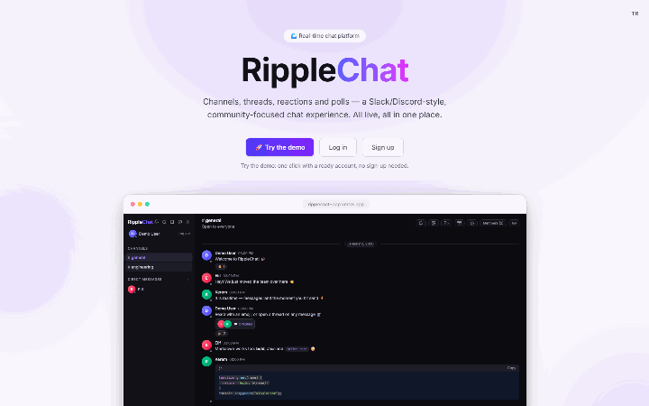
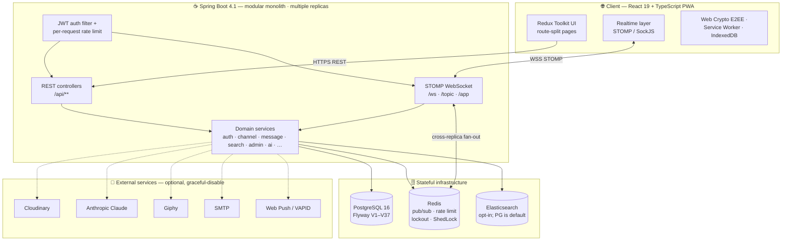
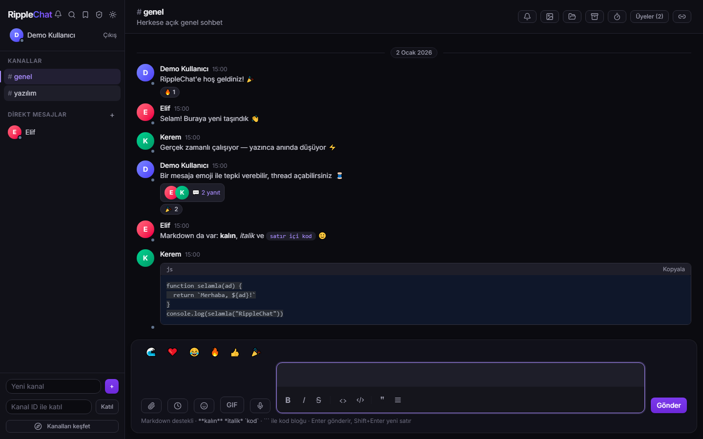
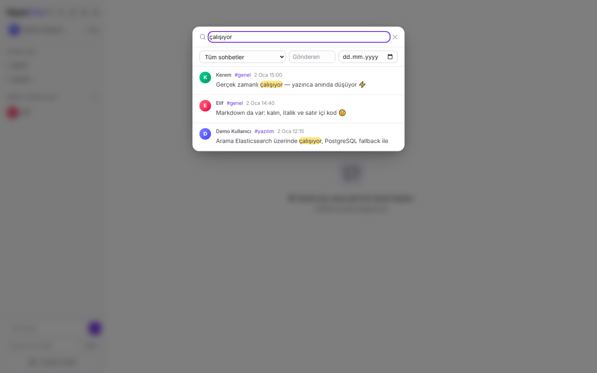
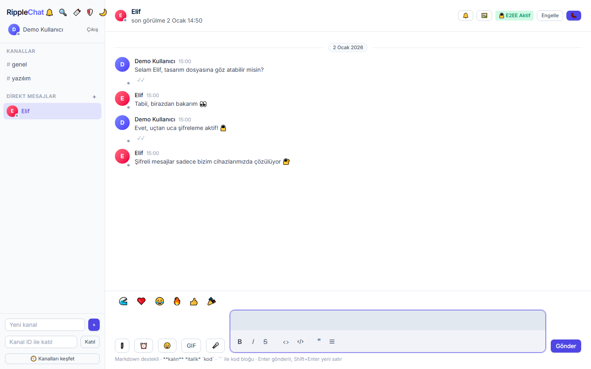
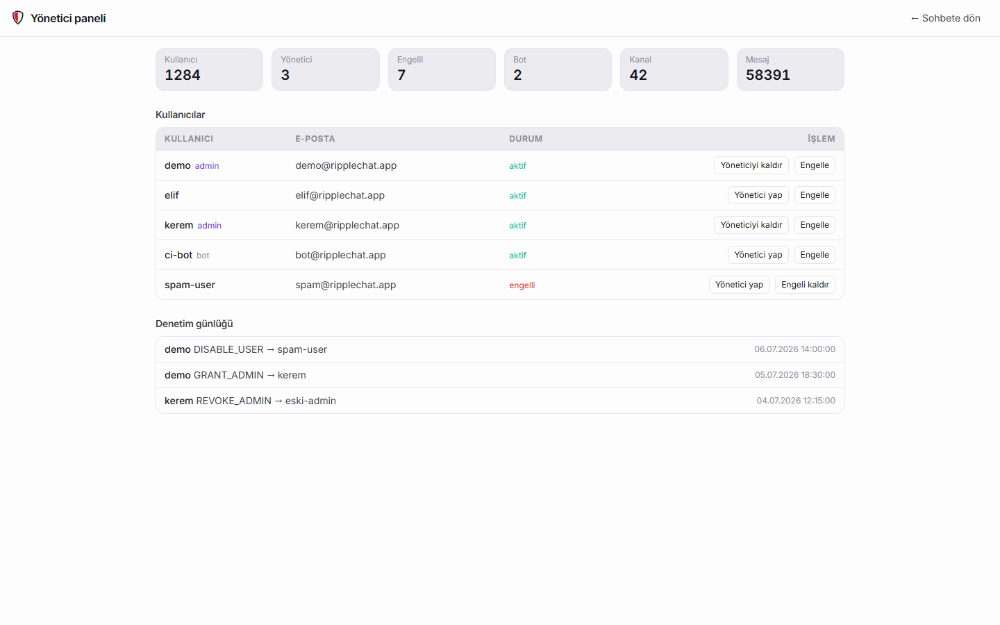
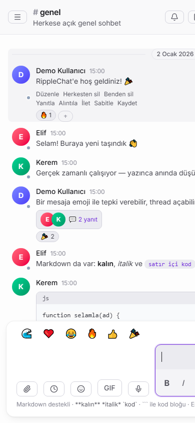

<p align="center">
  
</p>

# RippleChat

**Real-time, community-driven messaging platform** — a Slack/Discord-style workspace where channels, threads, reactions, and presence all update live over WebSockets. Built with a Spring Boot backend and a React + TypeScript frontend.


[](https://github.com/YusufKosarDev/ripplechat/actions/workflows/backend-tests.yml)
[](https://github.com/YusufKosarDev/ripplechat/actions/workflows/frontend-tests.yml)
[](https://github.com/YusufKosarDev/ripplechat/actions/workflows/e2e-tests.yml)

**[Live demo](https://ripplechat-app.vercel.app)** · **[API docs](https://ripplechat-backend.onrender.com/swagger-ui.html)** · demo account `demo` / `demo1234`



> The backend runs on a free tier and can cold-start, so the clip above shows the product while it wakes.

### In one minute

A full chat product rather than a chat demo: channels, DMs and group DMs, threads, reactions,
polls, presence and typing indicators all travel over one authenticated STOMP connection, and the
backend is built to run as **more than one replica** — which is where most of the interesting work is.

Five things worth a look if you are skimming:

| | |
|---|---|
| **Signal protocol, from scratch** | Double Ratchet + X3DH over the Web Crypto API for 1:1 DMs — forward secrecy and break-in recovery, with prekeys published to the server and plaintexts cached only in the browser ([`crypto/`](frontend/src/crypto)) |
| **Horizontally scalable WebSockets** | a Redis Pub/Sub bridge fans a message published on one replica out to subscribers connected to any other; rate limits are an atomic Redis token bucket rather than per-instance counters |
| **Correct under concurrency** | `@Scheduled` sweeps are wrapped in ShedLock so exactly one replica runs each tick, and media cleanup goes through a transactional outbox instead of a best-effort delete |
| **A JVM that starts fast** | the image unpacks the fat jar, does a CDS training run and maps the class archive back in at boot — about 35% off startup, which matters on a free-tier host |
| **Tested where it counts** | 175 backend integration tests against real PostgreSQL and Redis (Testcontainers), ArchUnit boundary rules, PITest mutation testing on the security-critical classes, and 20 Playwright end-to-end scenarios |

Built solo over ~5 weeks, 280+ commits.

---

## 🔗 Live Demo

- **App:** <https://ripplechat-app.vercel.app>
- **API docs (Swagger UI):** <https://ripplechat-backend.onrender.com/swagger-ui.html>

> Hosted on free tiers. The backend (Render) is kept awake by an external uptime monitor, and the frontend additionally pings it on page load, so the demo is usually ready immediately. Rarely — right after a redeploy or a missed monitor ping — the first request can still hit a cold start of a few minutes; the UI shows a "waking up" notice while it boots. On the landing page, click **“Try the demo”** for a one-click guided account — no signup needed.
>
> The UI follows your browser language (English or Turkish) and there is a toggle in the top-right corner.

**Demo account** (or log in manually):

| Username | Password |
|----------|----------|
| `demo`   | `demo1234` |

It lands on a pre-seeded workspace (`#general`, `#engineering`, `#design`) with sample messages, reactions, a thread and a poll.


---

## ✨ Features

Every *third-party* service below is optional — the app boots and degrades gracefully without it. PostgreSQL and Redis are the exception: they are core infrastructure and both ship in `docker-compose.yml`.

<details>
<summary><b>⚡ Real-time & Communication</b></summary>

- **Live messaging** over WebSocket / STOMP — messages fan out instantly to every subscriber of a channel
- **Distributed Pub/Sub (Redis)** — horizontally scalable WebSockets; messages published on any node are reliably broadcasted to users connected to other nodes via Redis Pub/Sub
- **Voice & Video Calls (WebRTC)** — peer-to-peer secure WebRTC calls with **screen sharing** (swapped in via `replaceTrack`, no renegotiation), local/remote stream rendering, mute/video toggles, and signaling via STOMP
- **Optimistic UI** — instant UI updates for messages and channels before server confirmation, with seamless fallback/error handling
- **Presence** — see who's online at a glance
- **Typing indicators** — know when someone in the channel is composing a message
- **Automatic reconnection** — the client recovers transparently from dropped connections, with a visible connection banner

</details>

<details>
<summary><b>💬 Messaging</b></summary>

- **Channels** with membership management, plus a **discover view** to browse and join the public channels you're not in yet (instead of only joining by id)
- **Direct messages** — private 1:1 conversations, plus **group DMs** (multi-party), reusing the same real-time pipeline
- **Threads** — keep focused reply chains off the main timeline
- **Edit & delete** messages — **delete for everyone** (soft delete) or **delete for me** (hide from your own view). Edited messages carry an **"(edited)"** badge that opens the full **edit history** — every superseded version is snapshotted and timestamped
- **Quote-reply** to a specific message, **forward** messages to other chats, and **pin** important messages
- **Saved messages** — bookmark any message and revisit them in a dedicated saved-items list (per-user, jump straight back to the message)
- **Rich Text Editor (TipTap)** — WYSIWYG editor with live markdown rendering, bold/italic, code blocks, quotes, and bullet lists
- **@mentions** with autocomplete, in-message highlighting, and a per-channel mention badge
- **AI channel summarization (Claude)** — a "✨ Summarize" button digests a channel's recent messages into a short catch-up summary via the official Anthropic SDK (`claude-3-5-sonnet-20241022` by default, `AI_MODEL`-overridable). Gracefully disabled when `ANTHROPIC_API_KEY` is unset, per-user rate-limited, and membership-checked. (True embeddings-based *semantic* search would need a separate embeddings provider — Anthropic has no embeddings endpoint — so it's out of scope here.)
- **Full-text search** — searches message content with sender, channel and date filters. Runs on **PostgreSQL full-text** (`to_tsvector`, GIN-backed) by default, so search works on a fresh clone with nothing extra to install. Set `APP_SEARCH_ELASTICSEARCH_ENABLED=true` against a real Elasticsearch to swap in the n-gram analyzer and BM25 ranking instead — both backends apply the same filters and return the same rows, only the ranking differs
- **Scheduled messages** — queue a message to a channel for a future time; a background dispatcher delivers due messages through the normal pipeline. `/remind` schedules one as a quick reminder
- **Infinite scroll** — older history loads as you scroll up

</details>

<details>
<summary><b>🎉 Interaction</b></summary>

- **Persistent emoji reactions** on any message, plus a **full emoji picker**
- **Live flying emoji** — reactions burst across the screen in real time
- **GIFs** — search and send GIFs from a picker (Giphy)
- **Polls** — create and vote on polls right inside a channel (`/poll`)
- **Slash commands** — an extensible command system (`/poll`, `/giphy`, `/shrug`, `/remind`)

</details>

<details>
<summary><b>📎 Media & attachments</b></summary>

- **Image, file, and voice-message attachments** (recorded in-browser), stored on Cloudinary
- **Automatic Storage Cleanup** — media files hosted on Cloudinary are reliably and automatically purged when the owning message is deleted
- **Per-channel media gallery** of shared images
- **Link previews** — URLs unfurl into title/description/image cards (server-side, SSRF-guarded)

</details>

<details>
<summary><b>🔌 Integrations</b></summary>

- **Incoming webhooks** — a channel moderator mints a token'd URL; external systems (CI, monitoring, …) POST `{"text":"..."}` and it lands in the channel as a dedicated **bot** identity. Only the token's **SHA-256 hash** is stored (the URL is shown once), the ingest endpoint is **rate-limited**, and bot accounts are hidden from people-search

</details>

<details>
<summary><b>🔔 Presence & notifications</b></summary>

- **Presence** and **last-seen** timestamps · **typing indicators**
- **Custom status** — an emoji + short text (with optional auto-expiry) shown next to your name and in DM headers
- **Do Not Disturb** — pause web-push notifications for a chosen window (30 min / 1 h / 8 h)
- **Activity center** — a bell with an unread badge that aggregates the events that involve you (someone **@mentioned** you, **replied** to your message, or **reacted** to it) into one feed; new activity arrives live over your own authorized STOMP topic, and clicking an item jumps to the message
- **Read receipts** — delivery/read ticks in direct messages
- **Web push notifications** (VAPID) for messages while you're away — suppressed while you're in Do Not Disturb
- **Mute** channels and DMs · **unread badges** with a live count in the browser tab title

</details>

<details>
<summary><b>🔐 Security & privacy</b></summary>

- **Two-Factor Authentication (2FA)** — TOTP-based multi-factor authentication via Google Authenticator/Authy using a secure Pre-Auth JWT handshake, with **single-use recovery codes** (shown once at enrollment, hash-only storage) that stand in for the authenticator at login and can be regenerated
- **JWT authentication** with stateless sessions and BCrypt-hashed passwords
- **Sign in with Google (OAuth2)** — an alternative to the password flow: the backend runs the authorization-code exchange, links or provisions the account, and hands back the same JWT + refresh-token pair. The authorization request rides in a short-lived cookie rather than the session, and the post-login redirect is checked against an allowlist on **scheme, host and port**, since that URL carries the tokens. Graceful-disable: `/api/auth/providers` reports whether a client id is configured and the button is hidden when it is not
- **Password reset & email verification** — token'd, single-use, expiring links delivered by email (only the SHA-256 hash is stored). The forgot-password endpoint is rate-limited and never reveals whether an address is registered; a reset ends every existing session. Email gracefully degrades to logging the link when no SMTP server is configured, so the flows work in development
- **Refresh tokens** with rotation, IP/User-Agent metadata tracking, and server-side revocation — short-lived access tokens are renewed transparently, and logout truly invalidates the session
- **Session & Device Management** — users can view active devices (with browser, OS, and IP address details) and perform remote session revocation (log out other devices)
- **Role-based authorization** per channel: `OWNER` › `MODERATOR` › `MEMBER`, with server-side moderation checks
- **Private channels** — live messages are restricted to members; subscriptions are authorized per channel so non-members can't eavesdrop
- **User blocking** — hide messages from blocked users
- **GDPR self-service** — download all of your own data as JSON, and erase your account: personal data is scrubbed and sign-in/session/notification artifacts are purged, while your past messages are retained under an anonymised "Deleted User" so other people's conversation history stays intact
- **End-to-end encryption (E2EE) (V2)** (opt-in) for 1-to-1 direct messages — implements **Signal's Double Ratchet Protocol** and **X3DH (Extended Triple Diffie-Hellman)** key agreement using Web Crypto API. Features **Forward Secrecy** (past keys are deleted) and **Break-in Recovery** (new DH ratchet steps heal the session), with automatic prekey generation and replenishment. Also supports legacy manual passphrase-derived (PBKDF2) symmetric encryption. Plaintexts are cached locally in the browser's IndexedDB decrypted cache, keeping the server blind to the content.
- **Safety numbers** — because prekey bundles and identity keys are served by *this* backend, a compromised server could hand each side a key it controls and sit in the middle; the ratchet secures the channel, not the identity at the far end of it. Each DM therefore exposes a **safety number** (iterated SHA-256 over both identity keys, rendered as twelve five-digit groups, ordered so both people see the same value) to compare out of band. Trust is otherwise **TOFU** — first key seen is trusted — which is the honest description of any system that distributes keys through its own server
- **Abuse protection** — input size limits plus distributed (Redis) rate limiting on login, **2FA verification**, **registration**, message sends, reactions, and webhook ingestion (rate-limited responses carry a `Retry-After` hint)
- **Account lockout** — after repeated failed password attempts an account is *temporarily* locked (auto-unlocks after a short cooldown, kept short to bound the DoS surface of a targeted lockout; the demo account is exempt). Counters live in Redis and lock events are audit-logged
- **Security headers** — the backend sets HSTS, `X-Frame-Options: DENY`, `X-Content-Type-Options: nosniff`, a `Referrer-Policy`, and a `frame-ancestors` CSP on every response; the static frontend (Vercel) adds a strict enforced **Content-Security-Policy**, `Permissions-Policy`, and the same hardening headers
- **Hardened secrets** — the JWT secret is validated at startup (rejects a too-short or placeholder value); SSRF guard on link unfurling; outbound calls (Cloudinary, link/GIF) are timeout-bounded
- **Security audit log** — authentication events (login success/failure/throttle, registration, refresh, logout) on a dedicated logger, correlated by request id
- **Admin panel** — global platform administrators (bootstrapped from `ADMIN_USERNAMES` — re-applied on every boot, so those users are effectively permanent admins — with further grants self-managed in-app) get a dedicated panel: headline stats (users, admins, channels, messages), a user table to **grant/revoke admin** and **disable/ban** accounts (a disabled user can't sign in; admins can't lock themselves out), and a **persisted audit trail** of every admin action. Access is gated server-side on the user's admin flag

</details>

<details>
<summary><b>🎨 Experience & platform</b></summary>

- **Quick switcher** — `Ctrl`/`Cmd`+`K` opens a Slack-style palette to jump between channels and DMs with full keyboard navigation
- **Light / dark theme** toggle and a **responsive** layout that adapts to mobile
- **Offline-First PWA** — progressive web app with a service worker (`vite-plugin-pwa`) that caches UI assets and uses **IndexedDB** (`idb`) to store messages locally. Users can read history and send "pending" messages while offline, which automatically sync to the backend when the network recovers.
- **Internationalization** — English / Turkish with a language toggle
- **Accessibility** — accessible dialogs (focus trap, Escape, focus restore), ARIA labels, a skip link, and **automated axe checks** in CI
- **Resilient UI** — an error boundary keeps a component crash from blanking the app, and a toast layer surfaces transient successes/errors
- **Fast first load** — route-level code splitting and on-demand chunks (pickers, syntax highlighter), plus gzip-compressed API responses
- **Disappearing messages** — an optional per-channel timer auto-deletes messages after it elapses
- **Channel organization** — categories and archiving · **profile & settings** (display name, avatar image/color, password)
- **Tested** — see [Testing](#-testing) for what is covered where; everything below runs in CI

</details>

<details>
<summary><b>📊 Observability & operations</b></summary>

- **RFC 7807 problem responses** — every error (validation, auth 401/403, framework) returns a consistent `application/problem+json` body
- **Prometheus metrics** at `/actuator/prometheus` and **build info** (version, build time) at `/actuator/info`
- **Request correlation** — each request gets an `X-Request-Id` that is echoed back and stamped on every log line for that request
- **Distributed tracing** — Micrometer Tracing over OpenTelemetry stamps a `traceId`/`spanId` on every log line and can export spans to an OTLP collector (Grafana Tempo / Jaeger). Sampling is off by default (no collector needed to run); set `TRACING_SAMPLE_RATE` + `OTLP_ENDPOINT` to enable export
- **OpenAPI / Swagger UI** (`/swagger-ui.html`, with a Bearer "Authorize") · **health endpoint** (`/actuator/health`)

---

</details>

## ⚡ Performance

Benchmarked locally with **k6** (20 virtual users, 30 s sustained load) against the read-heavy API path:

| Endpoint | Method | p50 | p95 | Threshold |
|----------|--------|-----|-----|-----------|
| `/api/channels` | GET | ~7 ms | ~11 ms | < 800 ms |
| `/api/channels/{id}/messages?page=0&size=20` | GET | ~12 ms | ~18 ms | < 800 ms |
| `/api/search/messages?q=…` | GET | ~9 ms | ~14 ms | < 800 ms |
| **Error rate** | | | | **0 % measured (< 1 % threshold)** |

> Latencies are from a local run on Spring Boot 4.1 (`k6 run loadtest/messaging.js`) with PostgreSQL in Docker and no Elasticsearch (search exercises the PostgreSQL full-text fallback). The hosted demo runs on free tiers (Render + Neon); an uptime monitor keeps the backend awake, but on the rare cold start (after a redeploy or missed ping) the JVM takes a few minutes to boot on the free instance. Warmed-up response times are comparable to the local numbers.

To reproduce:

```bash
k6 run loadtest/messaging.js                                     # defaults: 20 VUs, 30 s
k6 run -e BASE_URL=http://localhost:8081 -e VUS=50 -e DURATION=1m loadtest/messaging.js
```

---

## 🧱 Tech Stack

**Backend**
- Java 21
- Spring Boot 4.1 (Framework 7, Jackson 3)
- Spring Security (JWT access + rotating refresh tokens, HS384)
- Spring Data JPA · Spring Data Redis · Spring Data Elasticsearch
- Spring WebSocket (STOMP messaging)
- PostgreSQL (primary datastore + default full-text search) · Redis (distributed Pub/Sub & caching) · Elasticsearch (opt-in search engine)
- Cloudinary (media uploads) · web-push/VAPID (notifications) · dev.samstevens.totp (2FA) · Giphy (GIF search) · Anthropic Java SDK (Claude channel summarization)
- Caffeine (link-preview cache) · RFC 7807 ProblemDetail · gzip compression
- springdoc-openapi (Swagger UI) · Spring Boot Actuator · Micrometer + Prometheus

**Frontend**
- React + TypeScript
- Vite
- Redux Toolkit
- Tailwind CSS
- STOMP.js / SockJS
- TipTap (Rich Text Editor)
- WebRTC (P2P Video/Audio Calls + screen sharing)
- Web Crypto (E2EE) · Service Worker (PWA + push) · IndexedDB (Offline sync via idb)
- TypeScript strict mode · error boundary + in-house toast layer · route-level code splitting

**Testing** — JUnit 5 · Testcontainers · JaCoCo · ArchUnit · PITest · Vitest · React Testing Library · Playwright · axe · k6. See [Testing](#-testing).

**DevOps**
- Docker Compose (PostgreSQL + optional STOMP-enabled RabbitMQ)
- Flyway (production schema migrations)
- Maven · Spring profiles (dev / prod)
- GitHub Actions CI (backend, frontend, e2e) · container image build & publish to GHCR on push to `main` (with an optional deploy-hook step) · Dependabot (Maven, npm, Actions) · `npm audit` gate on shipped dependencies

---

## 🏗️ Architecture

The system at a glance — a React PWA talking to a horizontally-scalable Spring Boot monolith over REST + STOMP, backed by PostgreSQL / Redis / Elasticsearch, with all third-party services optional and graceful-disabled:



**Modular monolith backend.** The codebase is organized by domain, each package owning its own controllers, services, and persistence:

```
auth · user · channel (+ membership · direct messages · categories) · message (+ threads · pins · forwards · scheduled · edit history)
presence · typing · reaction · poll · search (full-text) · read receipts · push · notification · bookmark · link previews · media · gif
webhook · mail · scheduling (ShedLock) · ai (Claude summarization) · admin (moderation + audit log) · websocket
e2ee (X3DH prekeys · group sender keys) · outbox (transactional async cleanup) · redis (rate limiting · pub/sub fan-out) · demo (seeded demo workspace)
```

**WebSocket layer.** Clients open a single STOMP connection authenticated with a JWT on `CONNECT`. The server broadcasts to `/topic/...` destinations (e.g. `/topic/channels/{id}`); clients publish via `/app/...`. Messages, reactions, presence, typing, and polls all travel over this channel for instant fan-out.

**Frontend.** Application state lives in Redux Toolkit, with a dedicated realtime layer managing the socket lifecycle, subscriptions, and reconnection. UI state (theme, modals, unread counts) is kept in feature slices.

**Security is enforced on the backend.** Authentication and every role/permission check (channel membership, moderation, profile ownership) run server-side — the frontend never holds the authority, only reflects it.

**Dev vs. production.** Development favours fast iteration: Hibernate auto-updates the schema (`ddl-auto=update`) and SQL logging is on. The `prod` profile is hardened instead — schema is owned by **Flyway** migrations and only *validated* by Hibernate, SQL logging is off, and CORS / WebSocket origins come from an explicit, environment-configured allowlist (no wildcards). Responses also carry hardening headers (HSTS, `Referrer-Policy`, frame-deny, a `frame-ancestors` CSP).

> **Note on the Swagger UI.** It's left publicly reachable on this demo on purpose, as a showcase of the API surface — the exposure is low since every mutating endpoint requires a JWT and no secrets are returned. In a real production deployment you'd gate it behind authentication or disable it (`springdoc.api-docs.enabled=false`) to avoid publishing the API map.

---

## 🚀 Getting Started

### Prerequisites
- **Java 21**
- **Node.js** (with npm)
- **Docker** (for PostgreSQL and Redis)
- **Maven** (or use the bundled `mvnw` wrapper)

### 1. Clone & configure environment

```bash
git clone <your-repo-url> ripplechat
cd ripplechat
cp .env.example .env
```

Edit `.env` and set real values — most importantly a strong `JWT_SECRET` (≥ 32 bytes; generate one with `openssl rand -hex 48`) and your PostgreSQL credentials.

> The Vite dev server proxies API and WebSocket traffic to the backend on **port 8081**, which is what `SERVER_PORT` already defaults to in `.env.example` — change it only if you also change the proxy in `frontend/vite.config.ts`.

### 2. Start PostgreSQL and Redis

```bash
docker compose up -d
```

Redis is **required**, not one of the optional services: the rate limiter,
login lockout, presence and the cross-replica WebSocket fan-out all use it.

### 3. Run the backend

```bash
cd backend
./mvnw spring-boot:run
```

The API starts on `http://localhost:8081`.

### 4. Run the frontend

```bash
cd frontend
npm install
cp .env.example .env
npm run dev
```

Open **http://localhost:5173** — register an account and start chatting. The dev server forwards `/api` and `/ws` to the backend, so the browser stays same-origin (no CORS setup needed).

### Ports at a glance

| Service     | URL / Port              |
|-------------|-------------------------|
| Frontend    | http://localhost:5173   |
| Backend API | http://localhost:8081   |
| PostgreSQL  | localhost:5434 (host)   |
| Redis       | localhost:6380 (host)   |

### Running in production

The `prod` profile swaps auto-schema for validated, Flyway-managed migrations and locks down origins. Activate it with `SPRING_PROFILES_ACTIVE=prod` and provide:

| Variable | Notes |
|----------|-------|
| `SPRING_PROFILES_ACTIVE=prod` | enables Flyway + `ddl-auto=validate`, disables SQL logging |
| `POSTGRES_PASSWORD` | strong, unique (never `change-me`) |
| `JWT_SECRET` | long random secret — `openssl rand -hex 48` |
| `APP_ALLOWED_ORIGINS` | comma-separated allowed origins, e.g. `https://chat.example.com` |
| `POSTGRES_DB` · `POSTGRES_USER` · `POSTGRES_HOST_PORT` · `SERVER_PORT` | point at the production database / port |

On first boot against an empty database, Flyway applies the migrations in order (`V1__initial_schema` … `V37__group_sender_keys`) and Hibernate validates the schema against the entities. The full environment list lives in `.env.example`.

Several features are **optional and gracefully disabled when their credentials are absent**, so the app always boots: `CLOUDINARY_URL` (image/file/voice uploads), `VAPID_PUBLIC_KEY` / `VAPID_PRIVATE_KEY` / `VAPID_SUBJECT` (web push), `GIPHY_API_KEY` (GIF search), and SMTP (`MAIL_ENABLED` + `MAIL_HOST`/`MAIL_USERNAME`/`MAIL_PASSWORD`) for password-reset / verification email — without it those links are logged to the console instead of sent. Search runs on PostgreSQL full-text by default and never contacts Elasticsearch; set `APP_SEARCH_ELASTICSEARCH_ENABLED=true` (with an ES instance reachable at `spring.elasticsearch.uris`) to use it instead. Set `SWAGGER_ENABLED=false` to stop publishing the API docs. End-to-end encryption is entirely client-side and needs no server configuration.

---

## 📁 Project Structure

<details>
<summary>The full tree, package by package</summary>

```
ripplechat/
├── backend/                     # Spring Boot application
│   ├── src/main/java/com/ripplechat/backend/
│   │   ├── auth/                # Registration, login, JWT, security config
│   │   ├── user/                # Profiles, status/DND, settings, password, avatars, blocking
│   │   ├── channel/             # Channels, membership & roles, direct/group messages
│   │   ├── admin/               # Platform admin panel: user moderation + audit log
│   │   ├── demo/                # One-click demo account + seeded demo workspace
│   │   ├── message/             # Messages, threads, edit history, pins, forwards, quotes
│   │   │   └── scheduled/       # Scheduled messages + background dispatcher
│   │   ├── ai/                  # Claude channel summarization (Anthropic SDK, graceful-disable)
│   │   ├── webhook/             # Incoming webhooks (token'd ingest, bot identity)
│   │   ├── reaction/            # Emoji reactions
│   │   ├── poll/                # Polls (REST + WebSocket, persisted)
│   │   ├── presence/            # Online status & last seen
│   │   ├── typing/              # Typing indicators
│   │   ├── read/                # Read receipts
│   │   ├── notification/        # Activity center (mentions, replies, reactions)
│   │   ├── bookmark/            # Saved / bookmarked messages
│   │   ├── search/              # Message search (PostgreSQL tsvector by default, Elasticsearch opt-in)
│   │   ├── e2ee/                # Server side of E2EE: X3DH prekey storage, group sender keys
│   │   ├── push/                # Web push (VAPID) subscriptions & sending
│   │   ├── mail/                # Transactional email (reset / verification; logs when no SMTP)
│   │   ├── scheduling/          # ShedLock single-runner locking for @Scheduled tasks
│   │   ├── outbox/              # Transactional outbox for reliable async work (media cleanup)
│   │   ├── link/                # Link-preview unfurling (jsoup, SSRF-guarded)
│   │   ├── media/ · gif/        # Cloudinary uploads · Giphy GIF search
│   │   ├── redis/               # Redis rate limiter + cross-replica STOMP pub/sub bridge
│   │   ├── websocket/           # STOMP config & subscription auth
│   │   └── common/              # Shared errors, exceptions, request-id filter
│   └── src/main/resources/
│       └── db/migration/        # Flyway migrations V1–V37 (prod schema)
├── frontend/                    # React + TypeScript app
│   ├── public/                  # PWA manifest + service worker (sw.js)
│   └── src/
│       ├── api/                 # HTTP client & types
│       ├── app/                 # Redux store & hooks
│       ├── features/            # auth, channels, messages, threads, polls, presence,
│       │                        #   reads, blocks, muted, e2ee, unread, connection, ui …
│       ├── realtime/            # STOMP socket lifecycle
│       ├── crypto/              # Client-side E2EE (Web Crypto)
│       ├── i18n/                # EN/TR translations + provider
│       ├── commands/            # Slash-command registry
│       ├── components/          # UI components (+ ui/ primitives & useDialog)
│       ├── pages/               # Route-level views
│       └── ../e2e/              # Playwright end-to-end tests
├── docker-compose.yml           # PostgreSQL (+ STOMP-enabled RabbitMQ for the opt-in relay)
└── .env.example                 # Environment template
```

</details>

---

## 📸 Screenshots

**Channel** — live messages, reactions, a thread, markdown and a syntax-highlighted code block:


**Dark mode** — the same channel with the dark theme:



**Search** — full-text search across chats with highlighted matches and channel/sender/date filters:



**Direct message** — a private 1:1 conversation:


**End-to-end encryption** — the 🔒 badge in the DM header confirms E2EE is active, next to delivery/read ticks:



**Admin panel** — platform stats, user management, and the audit log:



**Mobile** — responsive layout on a phone viewport:



---

## 🧪 Testing

Coverage is deliberately uneven: the backend owns every authorisation and
persistence decision, so that is where the integration tests are. The frontend is
covered where the logic is genuinely hard — crypto, the realtime layer, reducers —
and by end-to-end scenarios everywhere else.

| Suite | What it covers | Size |
|---|---|---|
| **Backend integration** (JUnit 5 + Testcontainers) | real PostgreSQL, Redis and Elasticsearch containers — auth, 2FA, channel authorisation, messaging, search, webhooks, admin, the outbox, and a live STOMP round-trip | **175 tests · 68% line coverage** (JaCoCo) |
| **Architecture** (ArchUnit) | naming, one-directional layer dependencies, an independent `common` package, constructor injection | enforced on every build |
| **Mutation** (PITest) | the security-critical classes: rate limiter, JWT service, SSRF guard, upload validation | `mvn -Ppitest test org.pitest:pitest-maven:mutationCoverage` |
| **Frontend unit** (Vitest + RTL) | Double Ratchet / X3DH round-trips, the STOMP client, the channel hook, the send path, reducers, slash commands | **190 tests · 33% line coverage** (v8) |
| **End-to-end** (Playwright) | the real production build against a stubbed backend: landing, login, 2FA, chat, search, scheduled messages, blocking, pinning, theme and language toggles | **20 scenarios** (+8 screenshot generators) |
| **Accessibility** (axe) | landing, login and register pages, failing on critical/serious violations | part of the e2e run |
| **Load** (k6) | the read-heavy API path — see [Performance](#-performance) | `k6 run loadtest/messaging.js` |

```bash
cd backend  && ./mvnw verify          # tests + JaCoCo → target/site/jacoco/
cd frontend && npm run test:coverage  # unit tests + v8 → coverage/
cd frontend && npm run test:e2e       # Playwright (builds and previews first)
```

Backend, frontend and e2e each run as their own GitHub Actions workflow, alongside
CodeQL for both languages and an `npm audit` gate on shipped dependencies.

---

## 📈 Scaling & Roadmap

RippleChat is built to run behind a load balancer as **multiple backend replicas**. The pieces that would otherwise be per-instance state have been moved to shared infrastructure:

- **Distributed rate limiting** — the limiter is backed by **Redis** via an atomic token-bucket Lua script, so limits hold across replicas instead of per-instance.
- **Cross-replica WebSocket fan-out** — the local STOMP `SimpleBroker` is fronted by a **Redis Pub/Sub** bridge: a message published on one replica is fanned out to subscribers connected to *any* replica. (Each node still serves its own clients via `SimpMessagingTemplate`; Redis carries the cross-node hop.)

The timer-driven `@Scheduled` tasks are also replica-safe:

- **Single-runner scheduling (ShedLock)** — the disappearing-message expiry sweep and the scheduled-message dispatcher run on a timer. On multiple replicas they would run redundantly (e.g. double-delivering a scheduled message), so each task is wrapped with `@SchedulerLock` and a **ShedLock** distributed lock (backed by Postgres) elects a single runner — exactly one replica executes each tick.

> An **external STOMP relay** is also implemented, as an opt-in alternative to the Redis Pub/Sub bridge: set `WEBSOCKET_BROKER_TYPE=rabbitmq` (plus the `RABBITMQ_*` connection variables — a STOMP-enabled RabbitMQ ships in `docker-compose.yml` behind a profile — start it with `docker compose --profile rabbitmq up -d`) and the in-JVM broker is replaced with `enableStompBrokerRelay`, moving broker state out of the application entirely. The default stays the lighter Redis Pub/Sub bridge, which avoids the extra broker dependency.

Larger features still on the roadmap: **group voice/video calls** via an SFU media server (the current WebRTC calls are peer-to-peer 1:1 — see the grounded architecture plan in [`docs/group-calls-sfu.md`](docs/group-calls-sfu.md)), and a **native mobile wrapper** (Capacitor) around the existing PWA (wiring plan in [`docs/mobile-capacitor.md`](docs/mobile-capacitor.md)).

---

## 📄 License

This project is licensed under the **MIT License**.
